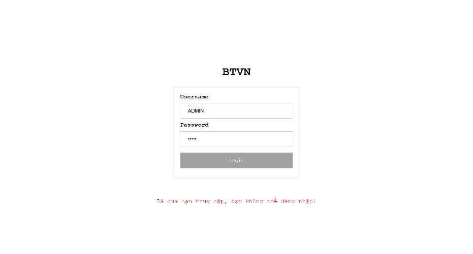
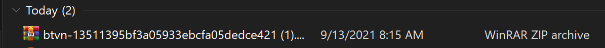
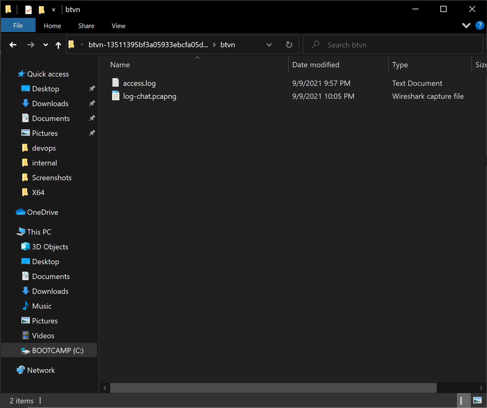

# Junior Hacking Talents Write Up
<!-- PROJECT LOGO -->
<br />
<p align="center">
  <a href="https://github.com/vudinhnamkhanh/CTF_writeup/">
    
  </a>

  <h3 align="center">Write up | Challenge - Bài tập quá hạn</h3>

<!-- ABOUT THE PROJECT -->
## About The Challenge

![Product Name Screen Shot][product-screenshot]]

Trong bài này chúng ta có 1 url và 1 tệp đính kèm:

* Url: http://btvn.kid.cyberjutsu-lab.tech/
* Tệp đính kèm:
    <li>
      <a href="https://vudinhnamkhanh.xyz/access.log">access.log</a>
    </li>
    <li>
      <a href="https://vudinhnamkhanh.xyz/log-chat.pcapng">log-chat.pcapng</a>
    </li>
    
---

Đề bài:

Gần đây phải học online, trường của Minh làm hẳn một trang web để đưa bài tập cho các bạn học sinh.

http://btvn.kid.cyberjutsu-lab.tech/

Nhưng lần này, cậu ấy lỡ tay xóa mất file bài tập trên máy tính của mình rồi. Thật buồn là đã quá hạn truy cập vào trang web để tải bài tập.
Hãy giúp Minh tìm lại file bài tập nhé!

Những manh mối ta có:

* Access log của server btvn.kid.cyberjutsu-lab.tech
* Trích xuất gói tin mạng đoạn chat giữa Minh và một người bạn
<!-- GETTING STARTED -->
## Bắt đầu


#### 1 > Thực hiện kiểm tra website

Cho dù ta nhập username hay password thì hệ thống sẽ báo “Đã quá hạn truy cập, bạn không thể đăng nhập”, có nghĩa là cho dù nhập ký tự vào ô username password đi trong nữa thì nút login sẽ không sáng màu để đăng nhập được.

## Phân tích đoạn chat
* Trích xuất file đã tải 


* Tiến hành giải nén file


* Đối với file access.log ta sẽ dùng code editor ( vsc, np++, etc) để đọc & phân tích log
* Đối với log-chat.pcapng ta sẽ dùng Wireshark để tiến hành phân tích dữ liệu gói tin mạng 

### Installation

1. Get a free API Key at [https://example.com](https://example.com)
2. Clone the repo
   ```sh
   git clone https://github.com/your_username_/Project-Name.git
   ```
3. Install NPM packages
   ```sh
   npm install
   ```
4. Enter your API in `config.js`
   ```JS
   const API_KEY = 'ENTER YOUR API';
   ```


<!-- USAGE EXAMPLES -->
## Usage

Use this space to show useful examples of how a project can be used. Additional screenshots, code examples and demos work well in this space. You may also link to more resources.

_For more examples, please refer to the [Documentation](https://example.com)_


<!-- ROADMAP -->
## Roadmap

See the [open issues](https://github.com/othneildrew/Best-README-Template/issues) for a list of proposed features (and known issues).


<!-- CONTRIBUTING -->
## Contributing

Contributions are what make the open source community such an amazing place to learn, inspire, and create. Any contributions you make are **greatly appreciated**.

1. Fork the Project
2. Create your Feature Branch (`git checkout -b feature/AmazingFeature`)
3. Commit your Changes (`git commit -m 'Add some AmazingFeature'`)
4. Push to the Branch (`git push origin feature/AmazingFeature`)
5. Open a Pull Request


<!-- LICENSE -->
## License

Distributed under the MIT License. See `LICENSE` for more information.


<!-- CONTACT -->
## Contact

Your Name - [@your_twitter](https://twitter.com/your_username) - email@example.com

Project Link: [https://github.com/your_username/repo_name](https://github.com/your_username/repo_name)


<!-- ACKNOWLEDGEMENTS -->
## Acknowledgements
* [GitHub Emoji Cheat Sheet](https://www.webpagefx.com/tools/emoji-cheat-sheet)
* [Img Shields](https://shields.io)
* [Choose an Open Source License](https://choosealicense.com)
* [GitHub Pages](https://pages.github.com)
* [Animate.css](https://daneden.github.io/animate.css)
* [Loaders.css](https://connoratherton.com/loaders)
* [Slick Carousel](https://kenwheeler.github.io/slick)
* [Smooth Scroll](https://github.com/cferdinandi/smooth-scroll)
* [Sticky Kit](http://leafo.net/sticky-kit)
* [JVectorMap](http://jvectormap.com)
* [Font Awesome](https://fontawesome.com)


<!-- MARKDOWN LINKS & IMAGES -->
<!-- https://www.markdownguide.org/basic-syntax/#reference-style-links -->
[contributors-shield]: https://img.shields.io/github/contributors/othneildrew/Best-README-Template.svg?style=for-the-badge
[contributors-url]: https://github.com/othneildrew/Best-README-Template/graphs/contributors
[forks-shield]: https://img.shields.io/github/forks/othneildrew/Best-README-Template.svg?style=for-the-badge
[forks-url]: https://github.com/othneildrew/Best-README-Template/network/members
[stars-shield]: https://img.shields.io/github/stars/othneildrew/Best-README-Template.svg?style=for-the-badge
[stars-url]: https://github.com/othneildrew/Best-README-Template/stargazers
[issues-shield]: https://img.shields.io/github/issues/othneildrew/Best-README-Template.svg?style=for-the-badge
[issues-url]: https://github.com/othneildrew/Best-README-Template/issues
[license-shield]: https://img.shields.io/github/license/othneildrew/Best-README-Template.svg?style=for-the-badge
[license-url]: https://github.com/othneildrew/Best-README-Template/blob/master/LICENSE.txt
[linkedin-shield]: https://img.shields.io/badge/-LinkedIn-black.svg?style=for-the-badge&logo=linkedin&colorB=555
[linkedin-url]: https://linkedin.com/in/othneildrew
[product-screenshot]: images/screenshot.png
[product-screenshot]: images/btvn3.png
