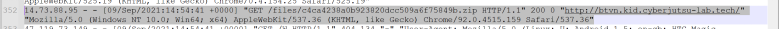
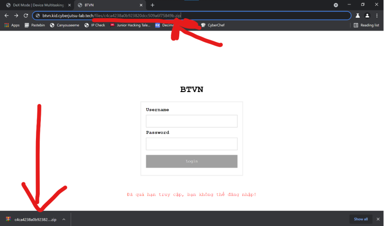
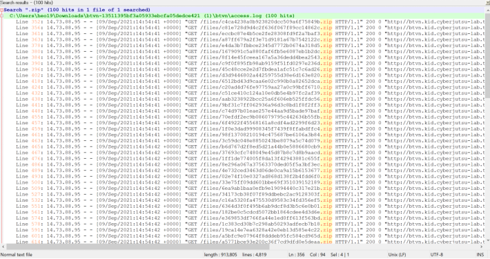
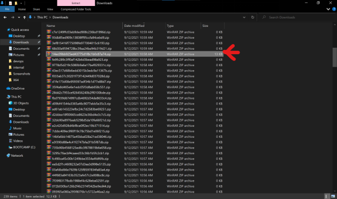
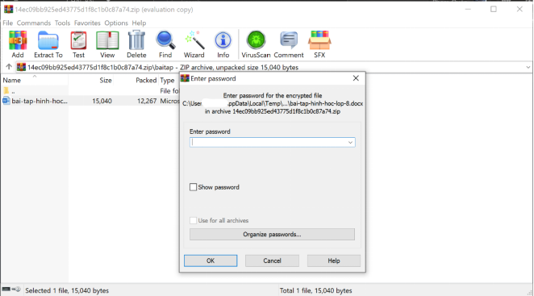
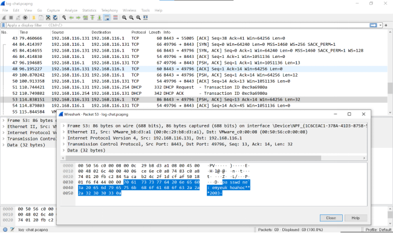
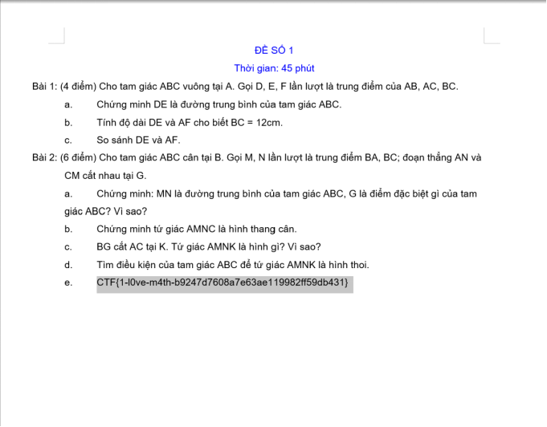

# Junior Hacking Talents Write Up
<!-- PROJECT LOGO -->
 

  

  <h3 align="center">Write up | Challenge - Bài tập quá hạn</h3>

<!-- ABOUT THE PROJECT -->
## About The Challenge

![Product Name Screen Shot][product-screenshot]]

Trong bài này chúng ta có 1 url và 1 tệp đính kèm:

* Url: http://btvn.kid.cyberjutsu-lab.tech/
* Tệp đính kèm:
    <li>
      <a href="https://cdn.cjstatic.com/kidctf-final/network-forensics/access-log/btvn-13511395bf3a05933ebcfa05dedce421.zip">access.log</a>
    </li>
    <li>
      <a href="https://cdn.cjstatic.com/kidctf-final/network-forensics/access-log/btvn-13511395bf3a05933ebcfa05dedce421.zip">log-chat.pcapng</a>
    </li>
    
---

Đề bài:

Gần đây phải học online, trường của Minh làm hẳn một trang web để đưa bài tập cho các bạn học sinh.

http://btvn.kid.cyberjutsu-lab.tech/

Nhưng lần này, cậu ấy lỡ tay xóa mất file bài tập trên máy tính của mình rồi. Thật buồn là đã quá hạn truy cập vào trang web để tải bài tập.
Hãy giúp Minh tìm lại file bài tập nhé!

---

Những manh mối ta có:

* Access log của server btvn.kid.cyberjutsu-lab.tech
* Trích xuất gói tin mạng đoạn chat giữa Minh và một người bạn
<!-- GETTING STARTED -->
## Bắt đầu

#### 1. Thực hiện kiểm tra website

Cho dù ta nhập username hay password thì hệ thống sẽ báo “Đã quá hạn truy cập, bạn không thể đăng nhập”, có nghĩa là cho dù nhập ký tự vào ô username password đi trong nữa thì nút login sẽ không sáng màu để đăng nhập được.

## Phân tích đoạn chat
* Trích xuất file đã tải 

* Tiến hành giải nén file

* Đối với file access.log ta sẽ dùng code editor ( vsc, np++, etc) để đọc & phân tích log
* Đối với log-chat.pcapng ta sẽ dùng Wireshark để tiến hành phân tích dữ liệu gói tin mạng 

[product-screenshot]: images/screenshot.png
[product-screenshot]: images/btvn3.png

### a. access.log
* Ở dòng  352 ta có:

* Ta thử thêm **/files/c4ca4238ab0b923820dcc509a6f7549b.zip** đằng sau url: http://btvn.kid.cyberjutsu-lab.tech

File đã được download xuống 

* Tiến hành tìm các file zip khác có trong log:

* Ta có 100 file zip, tiến hành tải hết tất cả dùng theo phương pháp trên
Trong 100 file thì ta sẽ thấy 1 file nặng 13KB, còn các file khác đều nặng 0byte

* Mở file ra ta thấy yêu cầu nhập password mà hiện giờ ta không  có, ta bắt  đầu tìm key qua log-chat.pcapng 

### b. log-chat.png

* Dùng Wireshark phân tích file

* Vậy ta đã có password: `emyeukhoahoc***2003`

* Nhập password tìm được từ log-chat.pcapng vào file 13kb ta đã tìm đc  

* WOALAH! Flag đã được tìm

---

© Vũ Đình Nam Khánh

